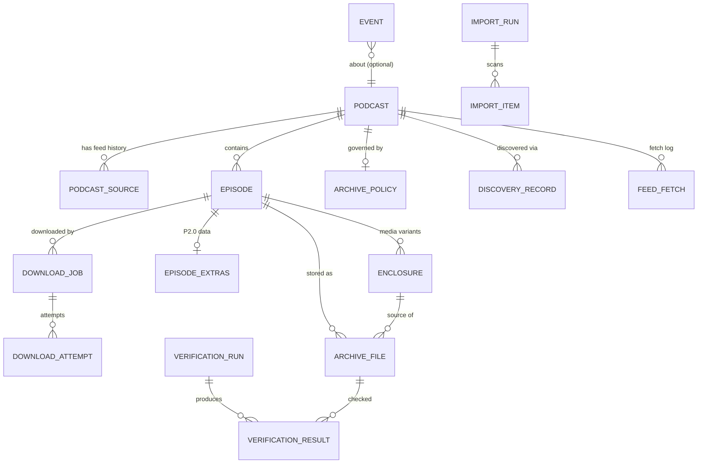

# Data Model

Entities, relationships and the SQLite schema sketch. The database is an **index over the archive**; sidecar files carry enough information to rebuild it (§5).

IDs are ULIDs (time-sortable, 26 chars, generated in-process); timestamps are UTC RFC 3339 stored as TEXT with an ISO layout so they sort lexically. JSON columns hold rarely-queried, evolving structures; everything queried or filtered has a real column and an index.

## 1. Entity overview



## 2. Entities

### Podcast (`podcasts`)

The show as the user sees it. Never contains provider-specific fields.

| Column | Type | Notes |
|---|---|---|
| id | TEXT PK | ULID |
| title, sort_title | TEXT | sort_title normalized (articles stripped, folded) |
| author, publisher, owner_name, owner_email | TEXT NULL | |
| description_html, description_text | TEXT NULL | |
| website | TEXT NULL | |
| artwork_url | TEXT NULL | source URL; the local copy is a `podcast_artwork` row (§10) |
| language | TEXT NULL | BCP-47 |
| categories | JSON | `["Technology","True Crime"]` |
| explicit | INTEGER NULL | |
| copyright | TEXT NULL | |
| podcast_guid | TEXT NULL | `podcast:guid` when present; indexed, **not unique** (hosts reuse GUIDs across shows; adding a second feed with a known GUID is refused by the engine instead) |
| feed_kind | TEXT | rss2 / atom / rss1 (was `feed_type` in the sketch) |
| status | TEXT | active / paused / error / archived |
| refresh_interval_secs | INTEGER NULL | per-podcast override |
| next_refresh_at, last_refresh_at | TEXT NULL | scheduler |
| last_error | TEXT NULL | |
| directory_name | TEXT NULL | never computed, always NULL (§5) |
| created_at, updated_at | TEXT | |

Indexes: `sort_title`, `status, next_refresh_at`, `podcast_guid`.

### Podcast source (`podcast_sources`)

Where the feed comes from, with history. Exactly one row per podcast is `is_current = 1`; a replaced row has `replaced_by_source_id`; a row with neither is the URL the feed announces and Uguisu has not verified, at most one per podcast, its fetch columns holding the last check ([ADR 0052](DECISIONS/0052-moving-a-feed-by-hand.md)).

| Column | Notes |
|---|---|
| id, podcast_id | |
| feed_url | as configured/discovered |
| canonical_url | from `atom:link rel=self` or redirects |
| website_url | |
| provider, provider_ref | `direct` for a podcast added by URL, `opml` for one added by an OPML import ([ADR 0049](DECISIONS/0049-opml-import-and-export.md)); a source that replaces another keeps its predecessor's value. No other value is written; `provider_ref` is unused |
| discovered_at, verified_at | |
| is_current | |
| replaced_by_source_id, replacement_reason | redirect / new-feed-url / manual; `matched-on-import` is defined and never written |
| http_etag, http_last_modified | conditional GET state for the current source |
| fetch_state, last_attempt_at, last_success_at, last_not_modified_at, last_error_at | never_fetched / fetching / fetched / not_modified / failed / disabled and its timestamps (Phase 3) |
| consecutive_failures, last_http_status, last_error_kind, last_error_detail | failure bookkeeping (`docs/FEED_ENGINE.md` §2) |
| content_fingerprint, last_content_length | sha256 of the last processed body; a byte-identical body is `not_modified` without parsing |

Feed URL changes create a new source row and flip `is_current`; the old row remains for auditing (brief §15). A move a person makes records `manual`.

### Episode (`episodes`)

| Column | Notes |
|---|---|
| id, podcast_id | |
| guid | as published (may be empty/duplicated in bad feeds) |
| guid_is_permalink | |
| identity_key | **computed** stable key, see §4 |
| identity_source, guid_key, enclosure_key, fingerprint_key, identity_reason | the signals behind `identity_key` as real, indexed columns (the sketch's `fingerprint` JSON) |
| content_hash | comparable hash over the fields whose change counts as an update (ADR 0015) |
| malformed, malformed_reason | placeholder rows for items the parser had to isolate (ADR 0017) |
| duplicate_of_episode_id, duplicate_reasons | candidate-duplicate link and reasons (ADR 0014); written on insert, changed only by a resolution (ADR 0051) |
| missing_streak | complete fetches without this item (ADR 0017) |
| published_at_raw, published_at_quality | the source string and exact / assumed_utc / future / ancient / invalid |
| sort_at | `COALESCE(published_at, first_seen_at)`, NOT NULL, the listing key |
| title, subtitle, sort_title | |
| description_html, description_text | |
| link | episode web page |
| published_at, updated_at_source | |
| duration_secs, duration_raw | parsed from `itunes:duration` (h:m:s, m:s, seconds, malformed → NULL + warning), and the string as written |
| season, episode_number, episode_type | full / trailer / bonus |
| explicit | |
| artwork_url | episode-level (`itunes:image`) |
| author | the item's author |
| source_metadata | JSON; never written, always NULL |
| archive_state | expected / skipped / queued / downloading / archived / missing / modified / failed (denormalized from jobs/files for fast listing) |
| skip_reason | "duplicate of <id>" for a candidate duplicate, "malformed item" for a placeholder; the policy's reasons go to `archive.policy_skipped`, not here |
| first_seen_at, last_seen_in_feed_at, removed_from_feed_at | feeds that drop old items must not delete archive state |
| created_at, updated_at | |

Indexes: `(podcast_id, sort_at DESC, id)`, `(podcast_id, identity_key) UNIQUE`, `(podcast_id, enclosure_key)`, `(podcast_id, fingerprint_key)`, `archive_state`. FTS5 over `title, subtitle, description_text` is built as a content-owning table beside this one (§11).

### Enclosure (`enclosures`)

Primary enclosure plus `podcast:alternateEnclosure` variants.

| Column | Notes |
|---|---|
| id, episode_id | `(episode_id, url)` unique; ids are stable across refreshes (upsert by URL, delete only vanished rows) |
| url | |
| mime_type, length_bytes | as declared |
| is_primary, position | |
| kind | audio / video / other |
| bitrate, height, codecs, lang, title | from alternateEnclosure |
| integrity_type, integrity_value | `podcast:integrity` (sri / pgp-signature) when present |
| sources | JSON list of `podcast:source` URIs |

### Episode extras (`episode_extras`)

One JSON document per episode holding Podcasting 2.0 data that is stored and returned with the episode, and embedded in no file (`ARCHIVE_ENGINE.md` §14): chapters URL/type, transcripts (url, type, language, rel), persons, location, soundbites, value/funding, license, txt, and unmodelled elements. Kept separate so the hot `episodes` table stays narrow.

### Archive policy (`archive_policies`) — sketch; as built in §9

One row per podcast (NULL podcast_id = global default).

```json
{
  "mode": "all | latest_n | newer_than | manual",
  "latest_n": 50,
  "newer_than": "P2Y",
  "auto_download": true,
  "include": [ {"episode_type": ["full","bonus"]}, {"title_regex": "…"} ],
  "exclude": [ {"episode_type": ["trailer"]}, {"duration_lt_secs": 120} ],
  "path_template": "{podcast.title}/{episode.year}/{episode.date} - {episode.title}.{extension}",
  "sanitization_profile": "portable",
  "metadata_policy": "rss_wins | existing_wins | fill_missing | overwrite | custom",
  "artwork": {"podcast": "download", "episode": "embed+sidecar", "replace_on_update": false}
}
```

Rules are evaluated in order; the first matching exclude wins over includes; the decision and the rule id are written to `episodes.skip_reason`.

### Download job (`download_jobs`) — built

One row per episode (`episode_id UNIQUE`), created by an enqueue and kept as the job's history afterwards. Details in [`DOWNLOAD_ENGINE.md`](DOWNLOAD_ENGINE.md).

| Column | Notes |
|---|---|
| id | ULID; also the `.part` file name, stable across retries |
| episode_id | **UNIQUE**, cascade; enqueue is idempotent per episode |
| podcast_id | cascade |
| enclosure_id | no foreign key: a refresh may replace the enclosure row |
| source_url, host_key | the URL being fetched and `scheme://host:port` for per-host limits |
| state, state_reason | the eight states and the closed reason vocabulary (`DOWNLOAD_ENGINE.md` §2) |
| priority | 0 low, 1 normal, 2 high |
| attempt_count, max_attempts | the retry budget; a user retry resets `attempt_count` |
| next_attempt_at | when a `retrying` job becomes eligible |
| bytes_downloaded, total_bytes | acknowledged bytes and the complete length when known |
| part_path, target_path | relative to the media directory, POSIX separators |
| content_type, sniffed_type | as served and as sniffed; recorded, never enforced |
| etag, last_modified, accept_ranges | resume validators |
| hash_algo, hash_value | `sha256`; the hash is written when finalization starts |
| last_http_status, last_error_kind, last_error_detail | typed diagnosis; the detail carries no headers |
| claimed_at, progress_at, started_at, finished_at, created_at, updated_at | |

Indexes: `(state, priority DESC, created_at, id)` for the claim, a partial `(next_attempt_at) WHERE state = 'retrying'` for the retry tick, `(podcast_id, created_at DESC, id DESC)` and `(created_at DESC, id DESC)` for listing.

### Download attempt (`download_attempts`) — built

Append-only history, one row per claim: `id`, `job_id` (cascade), `attempt_no`, `started_at`, `finished_at`, `source_url`, `range_start`, `http_status`, `bytes_received`, `duration_ms`, `avg_rate_bps`, `outcome` (`completed` / `failed` / `retry_scheduled` / `cancelled` / `paused` / `interrupted`), `error_kind`, `error_detail`, `next_attempt_at`. Unique `(job_id, attempt_no)`; the number is `MAX + 1` for the job, so it stays monotonic even though a user retry resets `attempt_count`.

### Download control (`download_control`) — built

One row (`CHECK (id = 1)`): `paused`, `paused_reason` (`user` / `disk_full`), `paused_at`, `updated_at`. A global pause is a transaction, not a flag in a process, so it survives restarts.

### Archive file (`archive_files`) — sketch; as built in §§9–10 and 13

Every file Uguisu owns in the archive.

| Column | Notes |
|---|---|
| id, podcast_id, episode_id (NULL for podcast-level files), enclosure_id | |
| kind | media / artwork / sidecar / transcript / chapters |
| relative_path | relative to the archive root, POSIX separators |
| size_bytes | |
| hash_algo, hash_value | `sha256` in v1; algorithm tagged so others can be added |
| mime_type, container_format | as detected from content, not from the feed |
| state | present / verified / missing / modified / metadata_mismatch / orphan |
| source_url, downloaded_at | |
| tags_written_at, tags_policy | |
| last_verified_at, mtime, inode_hint | for cheap change detection before hashing |
| created_at, updated_at | |

Indexes: `relative_path UNIQUE`, `(state)`. The sketched `(hash_algo, hash_value)` index for duplicate detection was never created: content-hash duplicates are not flagged (ADR 0051).

### Discovery record (`discovery_records`)

id, input, provider, provider_ref, feed_url, website, status, detail, steps (JSON), warnings (JSON), podcast_id (NULL until added), resolved_at, created_at. Provenance only — never used as the feed source (§11).

### Feed fetch (`feed_fetches`)

Rolling log per podcast and source: id, podcast_id, source_id, fetched_at, outcome (fetched / not_modified / failed), http_status, etag, last_modified, bytes, duration_ms, error_kind, error_detail, partial, truncated, fingerprint_changed, items_seen / added / updated / unchanged / malformed / removed / ambiguous, podcast_changed, url_change_detected, warnings (JSON). Trimmed to `UGUISU_FEED_RETAIN_FETCHES` (50) rows per podcast.

### Episode change (`episode_changes`)

Append-only change log (ADR 0015): id, episode_id, podcast_id, fetch_id, changed_at, field, old_value, new_value (each ≤ 1 KiB). One row per changed field per refresh; `identity_signals` rows record ADR 0014 matches, and a `duplicate_resolved` row (no fetch; old value the other episode, new value `same` or `separate`) records a person's resolution of a candidate duplicate (ADR 0051). Kept for the life of the episode: nothing prunes it (ADR 0015).

### Verification run / result — not built (§9)

`verification_runs`: id, scope (all / podcast / file), started_at, finished_at, counts (checked, healthy, missing, modified, mismatch). `verification_results`: run_id, archive_file_id, outcome, detail, repaired_by_job_id.

### Import run / item — not built (§10)

`import_runs`: id, root_path, started_at, finished_at, counts. `import_items`: run_id, path, size, hash, detected_tags (JSON), match_state (matched / ambiguous / unknown / ignored), matched_episode_id, match_reasons (JSON), decision (auto / manual / pending).

### Events (`events`)

id, occurred_at, kind, podcast_id?, episode_id?, payload (JSON, the flat event object of ADR 0010); indexes `(occurred_at, id)` and `(podcast_id, occurred_at)`. No `job_id` column: the job id is in every `download.*` payload (§8). Retention configurable (default 30 days or 100k rows); since Phase 7 the daily maintenance tick applies it (§11).

### Settings (`settings`)

key, value, updated_at, updated_by — the editable configuration layer. Built with `value` as **text, not JSON** (§11).

### Discovery cache (`discovery_cache`)

provider, kind, query_key, payload (JSON), fetched_at, expires_at. Survives restarts, honours provider TTLs. Built (§11).

## 3. Relationships and invariants

- A podcast has exactly one current source.
- `(podcast_id, identity_key)` is unique; two feed items resolving to the same key are the same episode (the later one updates metadata, never creates a second episode).
- A completed job marks the episode `archived`; it produces exactly one media `archive_file` once the archive engine exists (Phase 5).
- An episode has at most one download job, ever (`download_jobs.episode_id UNIQUE`); a re-download is the same row queued again.
- A file exists at `target_path` only after the job is `completed`; before that the bytes live in `part_path` under `<podcast-id>/.uguisu-tmp/`.
- `archive_files.relative_path` is unique across the whole archive; the path generator resolves collisions deterministically and records the chosen path. The suffix is derived from the episode's own id (` [01HQ3F]`, six Crockford base-32 characters), not from a counter: ADR 0022 replaced the `… (2)`/`… (3)` sketch because a counter depends on the order in which episodes happen to be downloaded, so the same episode would land somewhere else after a restart.
- Removing an episode from the feed never deletes archive files; it sets `removed_from_feed_at`.
- `duplicate_of_episode_id` names an episode of the same podcast stored before the candidate. Resolving `same` deletes the candidate's row, after moving its change rows to the original and repointing every candidate that named it (ADR 0051).
- Nothing in the library deletes an archived file, and there is no orphan state: a file whose record is gone is reported by `archive orphans` (ADR 0051).

## 4. Episode identity (brief §26)

`identity_key` is computed once per feed item and stored:

1. If the feed provides a non-empty GUID that is unique within the feed: `guid:<normalized guid>`.
2. Else if the primary enclosure URL (normalized: scheme-insensitive, tracking parameters stripped, redirect prefixes like `chtbl.com/track/...` and `pdst.fm/e/` unwrapped) is unique: `url:<normalized url>`.
3. Else `fp:<sha256(normalized title + published date (day precision) + enclosure length)>`.

The signals used are stored in `identity_source`, `guid_key`, `enclosure_key`, `fingerprint_key` and `identity_reason` so the choice is explainable. When a later refresh finds an item whose key matches nothing stored, ADR 0014 decides: a match by secondary signals **without contradiction** (one side has no GUID, or the same enclosure URL) is the same episode and keeps its key; **contradicting GUIDs** (or enclosure-based identities on different URLs with only the fingerprint agreeing) produce a new episode recorded as a **candidate duplicate** (`duplicate_of_episode_id`, `duplicate_reasons`, `archive_state = skipped`, `skip_reason = duplicate of <id>`) and surfaced by event and UI; nothing is merged or deleted automatically. A person resolves a candidate as `same` (merged into the original) or `separate` (an episode of its own) (ADR 0051). Content-hash matches are **not** flagged: a hash match exists only once both episodes hold a file, which a merge must refuse.

## 5. Sidecars and rebuildability

Written by the archive engine, read by `archive reconcile --rebuild` and by humans. As built (ADR 0024):

- `<episode file>.json` — one sidecar beside each media file, named after it. Schema version, generator, write time, podcast (id, title, author, publisher, feed URL, language, categories), episode (id, identity key, title, published date, GUID, enclosure URL, artwork URL, chapter and transcript references and more), archive facts (relative path, size, hash, origin, tag state, registered and tagged timestamps, the original tags) and the `source` record (hash and size as received, and where from).
- `<media>/.uguisu/manifests/<podcast-id>/manifest.sha256` — one `sha256sum -c` compatible list per podcast, media files only.

Two departures from the sketch above, both recorded in ADR 0024. There is **no `podcast.json`**: every fact it would carry is already in each episode sidecar, and a second document about the same podcast is a second thing that can disagree. The manifest lives under the media root keyed by podcast id rather than in `<podcast dir>/`, because `podcasts.directory_name` is never computed — the column exists and is `None` at every construction site, and the directory a podcast's files land in is whatever the active template renders, which the user may change at any time, so nothing durable can be keyed to it.

The sidecar name is not configurable. `<media>.json` is derived from the final media name and moves with it; an `.uguisu.json` switch would mean a rebuild had to guess which convention wrote a tree it is reading for the first time.

A database rebuilt from sidecars loses the events log, the fetch log and every verification **result**: rebuilt rows come back `unchecked` with reason `rebuilt`, because a sidecar is metadata, not evidence. Only a real `archive verify` may write `verified`.

## 6. Scale considerations

- Episode listings ride `(podcast_id, sort_at DESC, id)` (§7).
- `episode_extras` is JSON to avoid hundreds of nullable columns; `episodes.source_metadata` is a JSON column nothing writes.
- Keyset pagination on `(sort_at, id)` (`sort_at` is never NULL).
- The FTS5 index is kept current by triggers and built in batches when it is not ready (§11).
- Target, to be validated by the Phase 11 benchmark: 10k podcasts, 500k episodes, 500k archive files, list/filter queries < 50 ms on a laptop SSD.

## 7. Phase 3 deltas (as migrated)

Migration `crates/uguisu-storage/migrations/0001_phase3.sql` creates `podcasts`, `podcast_sources`, `episodes`, `enclosures`, `episode_extras`, `episode_changes`, `feed_fetches` and `events`. Differences from the Phase 1 sketch, all reflected above:

| Sketch | As built | Why |
|---|---|---|
| `podcasts.feed_type` | `feed_kind` (`rss2` / `atom` / `rss1`) | matches the parser's `FeedKind`; JSON Feed is not supported |
| `podcasts.podcast_guid UNIQUE` | indexed, not unique | hosts reuse GUIDs; the engine refuses a second feed with a known GUID (`conflict`) instead of a constraint error |
| `podcasts.directory_name NOT NULL` | nullable, and still `None` everywhere | no phase fills it. A podcast has no one directory: the path template decides where its files land, and the user may change it (§10, ADR 0024) |
| `podcasts` + `metadata_hash`, `subtitle` | new | change detection for channel metadata |
| `podcast_sources` conditional-GET state only | full fetch state (state, timestamps, failures, error kind/detail, validators, fingerprint, length) | `feed status` and failure safety need it on the source, not the podcast |
| one current source per podcast | partial unique index `(podcast_id) WHERE is_current = 1` | enforced in SQL |
| `episodes.fingerprint` JSON | real columns `identity_source`, `guid_key`, `enclosure_key`, `fingerprint_key`, `identity_reason` (indexed) | ADR 0014 looks episodes up by these |
| — | `content_hash`, `malformed`, `malformed_reason`, `duplicate_of_episode_id`, `duplicate_reasons`, `missing_streak`, `published_at_raw`, `published_at_quality`, `sort_at NOT NULL` | change detection, ADR 0014/0017, tolerant dates, stable listing order |
| `(podcast_id, published_at DESC)` | `(podcast_id, sort_at DESC, id)` | keyset paging with undated episodes |
| `enclosures` | + `position`, unique `(episode_id, url)` | stable ids and order across refreshes |
| — | `episode_changes` | ADR 0015 |
| `feed_fetches` (`not_modified`, `items_new`, `error`) | `outcome`, typed `partial`/`truncated`, per-class counters, `error_kind`/`error_detail`, `url_change_detected`, `podcast_changed` | the refresh report is stored one-to-one |
| `events.job_id` | not yet | Phase 4 |
| `archive_policies`, `download_*`, `archive_files`, `verification_*`, `import_*`, `discovery_records`, `settings`, `discovery_cache`, FTS5 | not created | later phases |

Timestamps are UTC RFC 3339 at second precision (`2026-09-17T10:42:00Z`) so text order equals time order. IDs are ULIDs generated by a process-wide monotonic generator, so ids created in one process order by creation time even within a millisecond.

## 8. Phase 4 deltas (as migrated)

Migration `crates/uguisu-storage/migrations/0002_phase4.sql` creates `download_jobs`, `download_attempts` and `download_control`; it alters nothing. Differences from the Phase 1 sketch:

| Sketch | As built | Why |
|---|---|---|
| `state` includes `skipped` and `verified` | eight states without them | `skipped` is an enqueue refusal (the episode carries it), `verified` belongs to the archive file (Phase 5) |
| — | `state_reason` | a closed vocabulary explains every non-obvious state, and recovery depends on it |
| — | `finalizing` | a crash between the rename and the completion write needs its own recovery |
| `last_error` | `last_error_kind` + `last_error_detail` | the kind drives the retry decision and the exit code; the detail is for humans |
| `resume_supported`, `resume_etag` | `accept_ranges`, `etag`, `last_modified` | `If-Range` needs the validator itself, and `Last-Modified` is a valid one |
| — | `host_key`, `claimed_at`, `progress_at`, `sniffed_type`, `hash_algo`/`hash_value` | per-host admission, recovery, integrity |
| `target_path` relative to the archive root | relative to the **media directory** (`UGUISU_MEDIA_DIR`) | the media root is configured separately (ADR 0020); templates land in Phase 5 |
| `download_attempts.bytes_range` | `range_start` | the end is implied by `bytes_received` |
| — | `download_control` | a global pause must be atomic and survive restarts |
| `events.job_id` | still not a column | the job id is in every `download.*` payload (ADR 0010, Phase 4 amendment) |
| `archive_files`, `verification_*`, `import_*`, `archive_policies`, `discovery_records`, `settings`, `discovery_cache`, FTS5 | not created | later phases |

`episodes.archive_state` is the projection of the job: `queued`/`retrying`/`paused` → `queued`, `downloading`/`finalizing` → `downloading`, `completed` → `archived`, `failed` → `failed`, `cancelled` → `expected`, and a deep reconcile may set `missing`.

## 9. Phase 5 deltas (as migrated)

Migration `crates/uguisu-storage/migrations/0003_phase5.sql` creates `archive_files` and `archive_policies`; it alters nothing. Differences from the Phase 1 sketch:

| Sketch | As built | Why |
|---|---|---|
| a row per verification run | verification columns **on the record** (`verification_state`, `verification_reason`, `verified_at`) | the common query is "what is wrong now"; the history is already in the event log (ADR 0021) |
| several archive files per episode | `episode_id` **unique** | one active artifact per episode; a repeat or concurrent registration upserts rather than racing. Moves live in the event log |
| — | `relative_path` **unique** | two artifacts can never claim one path, so a colliding relocation is refused by the database rather than by a check that could race |
| `verified`/`missing`/`modified` on the job | `VerificationState` on the archive record | the job says how the bytes arrived, the record whether they are still right; the episode's `archive_state` is projected from the record |
| — | `mtime_unix` | lets a light pass decide whether a size match is meaningful, without ever treating a changed mtime as a failure |
| — | `registered_at` separate from `created_at`/`updated_at` | "when this artifact was first archived" survives re-registration |
| `sidecar_path`, `manifest_*` | not created | sidecars and `manifest.sha256` are deferred (Phase 6, with import) |
| `import_*`, `orphan_*` | not created | archive import is Phase 6 |
| `archive_policies` with include/exclude rule lists | `mode`, `max_backlog`, `max_age_days`, `priority`, all nullable but `mode` | a nullable column means "use the global default", which is what makes a per-podcast override of one field possible without pinning the others (ADR 0023). Rule lists need a rule language nothing yet asks for |

Indexes: `(verification_state, created_at DESC, id DESC)` for the problem listings, `(podcast_id, created_at DESC, id DESC)` for per-podcast work, `(created_at DESC, id DESC)` for the list, and the two unique constraints.

`episodes.archive_state` gains no variant. For a completed job it is now projected from the verification: `verified` → `archived`, `missing` → `missing`, `invalid` → `modified`, `unchecked` → unchanged. Non-completed jobs keep the projection exactly, so no episode row needed migrating.

`download_jobs.target_path` now holds the **rendered template path** for jobs created in Phase 5 or later; jobs from Phase 4 keep their identifier path until `archive relocate` moves them. Both are relative to the media directory, so the column's meaning is unchanged.

## 10. Phase 6 deltas (as migrated)

Migration `crates/uguisu-storage/migrations/0004_phase6.sql` adds eight columns to `archive_files`, backfills them, and creates `podcast_artwork` and `archive_manifests`. It drops nothing and rewrites no existing value.

### `archive_files`, eight new columns

| Column | Meaning |
|---|---|
| `source_size_bytes`, `source_hash_algo`, `source_hash_value` | what was **received** — written once at registration or import and never again |
| `origin` | `download` / `import` / `rebuild`, NOT NULL DEFAULT `'download'` |
| `tag_state` | `untagged` / `pending` / `written` / `unsupported` / `failed`, NOT NULL DEFAULT `'untagged'` |
| `tag_mode` | which mode wrote the tags, `fill_missing` or `sync` |
| `tagged_at`, `sidecar_written_at` | when, so recovery and the sidecar backlog are queries rather than scans |

`hash_value` and `size_bytes` keep their meaning: **the bytes on disk now**. That is what makes the whole of Phase 5 — `verify`, `reconcile`, `relocate`, the three depths — untouched by Phase 6. Tag writing moves `hash_value`; nothing ever moves `source_hash_value`. The pair is what separates "Uguisu retagged this file" from "something changed this file": the first has a new `hash_value`, an unchanged `source_hash_value` and `tag_state = written`; the second has a new `hash_value` and nothing to explain it.

The `source_*` columns are added **nullable** because SQLite cannot add a NOT NULL column without a constant default, and any constant here would be a lie. The backfill sets them from `hash_value`/`size_bytes`/`hash_algo` for every pre-row, which is correct for exactly those rows: nothing had ever rewritten an archived file.

Two **partial** indexes, both normally empty: `idx_archive_tag_state … WHERE tag_state <> 'untagged'` and `idx_archive_no_sidecar … WHERE sidecar_written_at IS NULL`. Recovery after a crash and the sidecar backlog must both cost O(work to do), not O(archive), so that starting up does not get slower as the archive grows.

### `podcast_artwork`

id, podcast_id (cascade), source_url, relative_path UNIQUE, format, content_type, size_bytes, hash_algo, hash_value, etag, last_modified, is_current, retrieved_at, created_at, updated_at; `UNIQUE (podcast_id, hash_value)` and a **partial unique index** on `(podcast_id) WHERE is_current = 1`.

Artwork could not live in `archive_files`: that table's `episode_id` is unique and artwork has no episode, and its `kind` column was never built. A separate table also lets the file be content-addressed — `<media>/.uguisu/artwork/<podcast-id>/<sha256>.<ext>` — so fetching a replacement can never destroy the previous one, and the history stays queryable. "Exactly one current image per podcast" is enforced by the index rather than by a check that could race.

### `archive_manifests`

podcast_id PRIMARY KEY (cascade), relative_path, entries, hash_value, stale, generated_at, stale_since, updated_at; partial index on `(podcast_id) WHERE stale = 1`.

The manifest **file** is derived data; this row is what says whether it still matches the index. `stale` is set inside the same transaction that changes an artifact, so a crash can only ever leave "marked stale but actually fresh" — never a manifest that silently disagrees with the archive. A download therefore never waits on a manifest write, and `entries`/`hash_value` let `archive manifest status` answer without reading the file.

### Differences from the Phase 1 sketch

| Sketch | As built | Why |
|---|---|---|
| `archive_files.kind` (media / artwork / sidecar / …) | not added | the table holds episode media and nothing else. A sidecar is named after its media file and needs no row; artwork has its own table; transcripts and chapters are not built |
| `archive_files.tags_written_at`, `tags_policy` | `tag_state`, `tag_mode`, `tagged_at` | a timestamp cannot express "a write is in progress", and that is precisely the state a crash leaves behind. `tag_state` is written and committed **before** any byte moves |
| `import_runs` / `import_items` | not created | an import run is a plan and a report, both computed and both returned; persisting them would add a second source of truth for something that is finished when the command exits. The event log records what happened |
| `verification_runs` / `verification_results` | still not created | unchanged from Phase 5: the current state is on the record, the history is in the event log |
| `orphan_*` | not created | an orphan is a **finding**, reported by `archive orphans` out of what is on disk (ADR 0051). Nothing deletes, so there is nothing to track between runs |
| `<podcast dir>/podcast.json` | no podcast-level sidecar | every fact is already in each episode sidecar (§5) |
| manifest in `<podcast dir>/.uguisu/` | `<media>/.uguisu/manifests/<podcast-id>/` | `podcasts.directory_name` is never computed, and could not be: the directory is whatever the active template renders, and the user may change it (ADR 0024) |

`.uguisu/` directly under the media root is **reserved**. It holds `tmp/`, `manifests/` and `artwork/`, and every enumerator skips it: the rebuild scanner, the import scanner, collision occupancy and relocation. `sanitize::segment` also refuses to produce it, so no podcast or episode title can render a directory that shadows the control directory.

`episodes.archive_state` gains no variant and its projection is unchanged. Tagging a file moves `hash_value` and the episode stays `archived`, because the record still agrees with the bytes.

## 11. Phase 7 deltas (as migrated)

Migration `crates/uguisu-storage/migrations/0005_phase7.sql` adds the tables the service needs and the search index. It drops nothing and rewrites no existing value.

### `settings`

`key TEXT PRIMARY KEY, value TEXT NOT NULL CHECK (length(value) <= 4096), updated_at, updated_by`.

The key *is* the `UGUISU_*` environment variable's name and the value is exactly the text that variable would hold. A row that no longer parses is **quarantined, never deleted** — it is the only copy of what somebody meant ([ADR 0028](DECISIONS/0028-persisted-settings-and-precedence.md)).

### `scheduler_control`

One row (`CHECK (id = 1)`): `paused`, `paused_reason`, `paused_at`, `last_maintenance_at`, `updated_at`. Deliberately not `download_control`: a full disk pauses transfers automatically, and feeds must keep being refreshed when transfers stop. `last_maintenance_at` is what lets a restart re-derive the next housekeeping time instead of running it on every boot.

### `idx_podcasts_due`

`ON podcasts (next_refresh_at, id) WHERE status = 'active' OR status = 'error'`. Partial and ordered the other way round from `idx_podcasts_status_next`, so "what is due next" is a seek rather than a scan. The predicate is spelled `OR` rather than `IN` because SQLite's partial-index prover matches the query's `WHERE` against the index's, and the due queries repeat this clause verbatim.

### `discovery_cache` and `discovery_records`

The cache is keyed `(provider, kind, query_key)` and carries wall-clock `fetched_at`/`expires_at`, because the in-memory tier's monotonic instants mean nothing after a restart. The records table is provenance only: `podcast_id` is `ON DELETE SET NULL`, so a resolution outlives the podcast it produced, and nothing ever reads a record back as a feed source ([ADR 0030](DECISIONS/0030-discovery-persistence.md)).

### The search index

`episodes_fts` and `podcasts_fts` are content-owning FTS5 tables carrying the ULID as an `UNINDEXED` column; `episode_search_ids(seq INTEGER PRIMARY KEY AUTOINCREMENT, episode_id TEXT UNIQUE)` gives every episode a stable integer rowid; `search_index_state` says whether the index can be trusted. Seven triggers keep it current, and the migration creates them without filling the index — a hundred thousand rows inside `Engine::open` would be tens of seconds that an interrupted start rolls back and repeats for ever ([ADR 0029](DECISIONS/0029-local-search-index.md)).

`PRAGMA recursive_triggers` joins `foreign_keys` in `Storage::open_path`, or a cascade fires no triggers and deleting a podcast leaves its episodes in the index.

### Differences from the Phase 1 sketch

| Sketch | As built | Why |
|---|---|---|
| `settings.value` as JSON | text, in environment-variable syntax | a second syntax means a second parser and a second way to be wrong. One vocabulary means a stored row and an exported variable say the same thing |
| settings above the environment | **environment above settings** | an operator who writes a variable into a unit file has to be able to rely on it; a key set there is pinned and a write to it is refused ([ADR 0028](DECISIONS/0028-persisted-settings-and-precedence.md)) |
| `config.toml` between defaults and environment | not in v1 | an environment file is the file-based configuration (ADR 0028) |
| `discovery_cache (provider, query_key)` | `(provider, kind, query_key)` | a search and a lookup can share a key; the kind separates them |
| a scheduler claim column | none | one process owns a data directory, and the coalescer already arbitrates within it ([ADR 0027](DECISIONS/0027-service-and-refresh-scheduler.md)) |

## 12. Phase 9 deltas (as migrated)

Migration `crates/uguisu-storage/migrations/0006_phase9.sql` adds the three tables authentication needs and three indexes the API needed. It drops nothing and rewrites no existing value, and it stores **no personal data**: no IP address, no user agent. Nothing would read them, and they would be the only such data in the database.

### `auth_credential`

One row (`CHECK (id = 1)`): `username` (1–64 characters), `password_hash`, `created_at`, `updated_at`. The hash is an argon2id PHC string, so the parameters live in the value and raising them re-hashes on the next successful login.

Deliberately **not** a `users` table with a role column. ADR 0013 claimed one existed "from the first migration"; it never did, and Uguisu has one operator. Multi-user, if it ever arrives, is a forward migration like every other change here ([ADR 0035](DECISIONS/0035-credentials-sessions-and-tokens.md), and 0013's Correction).

### `auth_sessions`

`id` (a ULID that may appear in a log), `token_digest` (UNIQUE), `csrf_token`, `created_at`, `last_seen_at`, `idle_expires_at`, `absolute_expires_at`, `revoked_at`.

The cookie the browser holds is a separate 256-bit secret that exists here **only as a SHA-256 digest**, so a stolen database cannot be replayed as a session. The CSRF token is stored in the clear on purpose: it is useless without the cookie, and hashing it would cost a digest per mutation and buy nothing. Validity is `revoked_at IS NULL AND idle_expires_at > now AND absolute_expires_at > now`; `idx_auth_sessions_idle` exists because housekeeping asks "what has expired", never "whose session is this".

`last_seen_at` and the idle deadline refresh **at most once an hour**: the writer pool has size 1, and a write per request would serialise the whole API behind this table.

### `auth_tokens`

`id`, `name` (1–64 characters), `token_digest` (UNIQUE), `scope` (`CHECK (scope IN ('read', 'write'))`), `created_at`, `last_used_at`, `expires_at`, `revoked_at`.

A token is shown once and never again; of the secret, only the digest survives. A revoked row is **kept**, so a listing can say it was revoked. ADR 0013's third scope, `admin`, is withdrawn — the API has two authenticated levels ([ADR 0036](DECISIONS/0036-three-access-levels.md)).

### `idx_podcasts_page` and `idx_fetches_source`

`ON podcasts (sort_title, id)` — `idx_podcasts_sort_title` (0001) orders but cannot resolve the tie-break without a row visit, and the podcast list keysets on the pair ([ADR 0040](DECISIONS/0040-one-cursor-contract.md)).

`ON feed_fetches (source_id, fetched_at DESC)` — `feed_fetches` had no index on `source_id` at all (0001 indexes `(podcast_id, fetched_at)`), so "the newest fetch of this source" scanned the whole fetch log, once per podcast, per podcast-list request.

The podcast list is pinned by an `EXPLAIN QUERY PLAN` guard in `crates/uguisu-storage/src/podcasts.rs`, which fails if its ordering becomes a sort rather than an index walk. `idx_fetches_source` has no such guard.

### Differences from the Phase 1 sketch

| Sketch (ADR 0013) | As built | Why |
|---|---|---|
| `users` table with a role column, from migration 0001 | one `auth_credential` row, in 0006 | it never existed, and a schema shaped for a feature nobody asked for is a schema that lies |
| token scopes `read`/`write`/`admin` | `read`/`write` | no route asks a question the third would answer |
| session rows keyed to a user | no user column | there is one operator; a column that is always the same value is noise |
| an auth event in the event log | none | authentication is not archive history, and an event is persisted and user-visible. Failures are logged by category only |

## 13. Phase 10 deltas (as migrated)

Migrations `0007_phase10.sql` and `0008_phase10_source_changed.sql` add two columns to `archive_files`:

| Column | Holds |
|---|---|
| `original_tags` | JSON: the managed tags the file carried before Uguisu's first tag write (field name → value) and its embedded cover as mime, size and SHA-256, never the image. NULL until a write captures it, NULL for good on a file Uguisu tagged before the column existed, and reset by a re-download ([ADR 0012](DECISIONS/0012-metadata-tagging.md)). |
| `source_changed_at` | when a refresh last found the feed pointing at different audio for this download (the primary enclosure's URL or declared length changed). The file is kept; NULL means unchanged since the download, and a re-download clears it ([ADR 0015](DECISIONS/0015-change-log-instead-of-versioning.md)). |

---

*Status: Phase 10, migrations 0001–0008. Tables of §7–§13 are normative as migrated; the remaining sketches are finalized by the phases that create them.*
