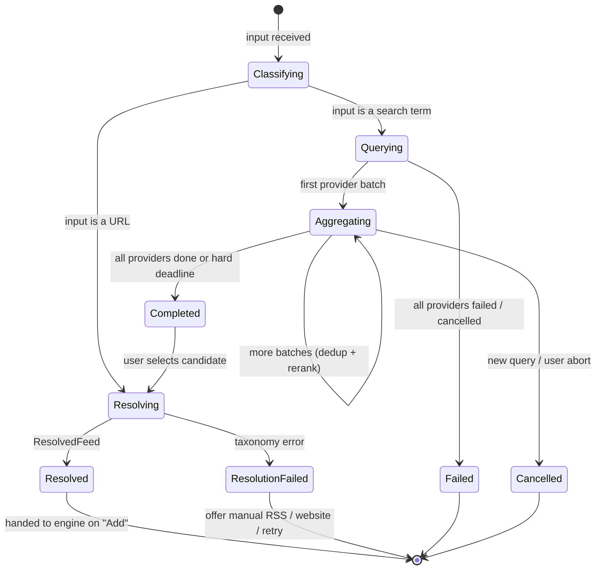
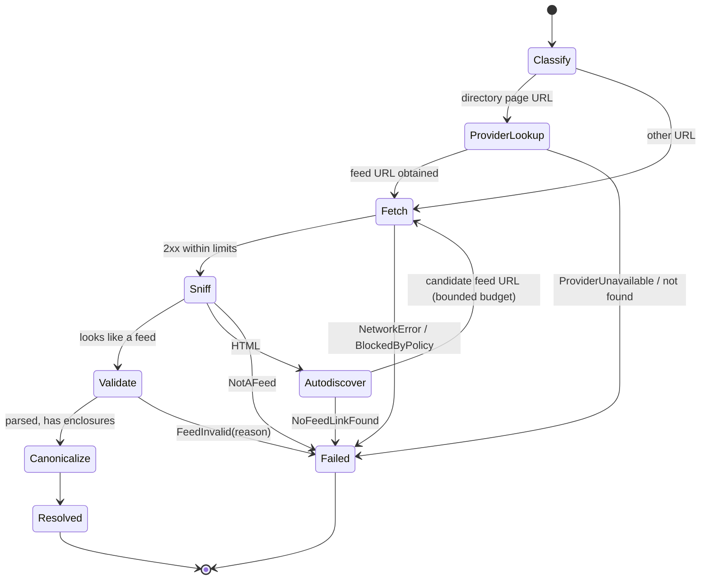
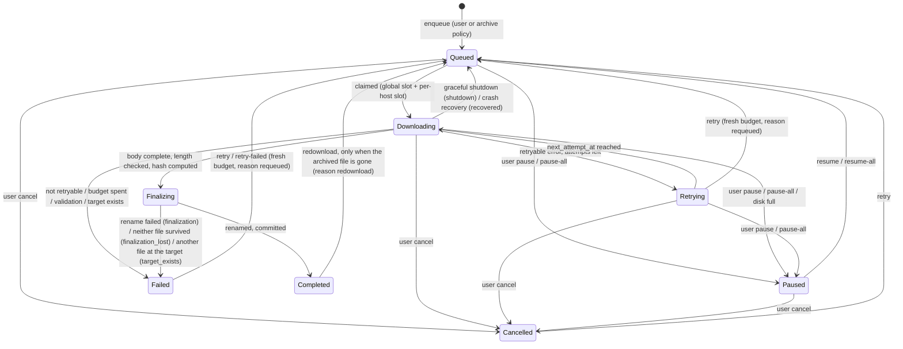
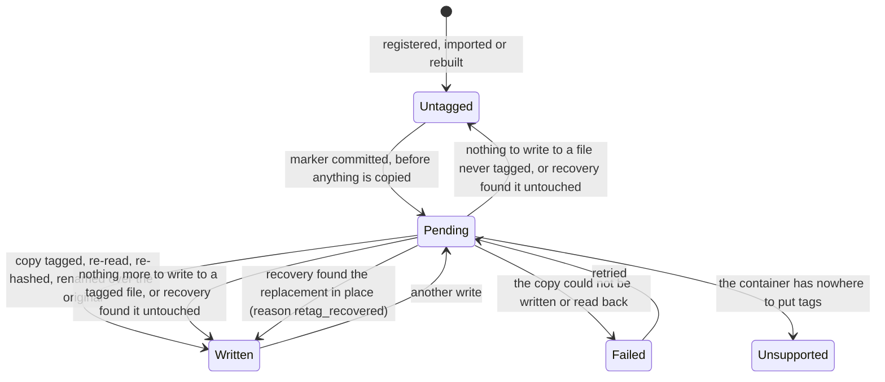

# State Machines

The lifecycles that govern Uguisu: what each state means, what moves between them, and what a crash leaves behind. Diagrams use Mermaid.

## 1. Discovery session

A search is a short-lived, in-memory session; provider answers may be cached (`discovery_cache`), and each resolution the engine runs persists, resolved or not, as a `discovery_record` (ADR 0030).



Invariants: no state in this machine writes to `podcasts`; provider failures are per-provider annotations, not session failures, unless every provider fails.

## 2. Feed resolution



Budget per resolution: ≤ 5 redirects per request, ≤ 8 requests total, ≤ 30 s total; each request has the shared HTTP timeouts. Every step is recorded in the resolution's `provenance` (a `discovery_record`'s `steps`).

## 3. Download job

Built (`uguisu-download`); the prose is in [`DOWNLOAD_ENGINE.md`](DOWNLOAD_ENGINE.md), the decisions in [ADR 0018](DECISIONS/0018-download-state-machine-and-queue.md) and [ADR 0019](DECISIONS/0019-resume-and-finalization.md). `transition(state, event)` in `uguisu-download::state` is the normative table; this diagram is its picture.



`completed` is the only state no command, retry or worker leaves; only a redownload of a file that is gone does ([ADR 0060](DECISIONS/0060-repairing-a-missing-file.md)). `finalizing` ignores cancellation: once the hash is written the job finishes its rename, which is what `finalization_lost` recovery exists for. `state_reason` comes from a closed vocabulary (`user`, `requeued`, `recovered`, `shutdown`, `resumed`, `source_changed`, `paused_all`, `disk_full`, `max_attempts`, `not_retryable`, `validation`, `target_exists`, `finalization`, `finalization_lost`, `source_missing`, `redownload`); a `retrying` job carries its error kind instead, and `finalizing` and `completed` carry none.

Mapping from the brief's sketch: `Preparing` and `Validating` are steps inside `downloading` (logged, no separate recovery), `Interrupted` is `queued(recovered)` or `queued(shutdown)`, `Skipped` is an enqueue refusal recorded on the episode, and `Verified` belongs to the archive file (§4).

### Invariants

- Only `.part` files exist below the media root before `completed`; a final path is created exclusively by an atomic rename from `<podcast-id>/.uguisu-tmp/<job-id>.part`, which lives under the same media root as the target.
- `completed` requires: a consistent 200/206 chain, received bytes equal to `Content-Length` when it was sent, a non-empty body within `max_bytes`, the SHA-256 computed while streaming, `sync_all` on the file and (on Unix) an fsync of the target directory before the state is written.
- Every worker write is a compare-and-set on the expected state; a user command writes the database first and cancels the token second, so the command always wins.
- Resume is allowed only with `Accept-Ranges: bytes` and a matching strong `ETag` or `Last-Modified`; the offset is `min(file length, acknowledged bytes)` and the prefix is re-hashed first. A `200` after a Range request, or a `206` starting elsewhere, restarts or fails rather than appending.
- Retry schedule `min(30 s × 2^(attempt−1), 6 h)` with jitter, `max_attempts = 8`, `Retry-After` preferred when it does not exceed the cap; `next_attempt_at` is persisted, so a restart cannot produce a retry storm.
- A full disk pauses the whole queue (`paused_all(disk_full)`, persisted), refunds the attempt and emits `download.paused_all`; only `resume-all` lifts it.
- A job deletes nothing but its own `.part`, when the enclosure URL changed: an existing target ends the job `failed(target_exists)`, an unknown `.part` is reported as an orphan, a vanished file is reported by a deep reconcile.
- One job per episode ever (`download_jobs.episode_id UNIQUE`); a failed or cancelled job is queued again in the same row, and a completed one only by a redownload.

### Crash recovery (startup, `Engine::open`)

1. `downloading` → `queued(recovered)`; open attempts are closed as `interrupted`.
2. `finalizing`: a file of the recorded size at the target → `completed`; anything else at the target → `failed(target_exists)`, keeping it and the `.part`; only the `.part` exists → finalization is redone, and a rename that fails again fails the job as `target_exists` or `finalization`, keeping the `.part`; neither → `failed(finalization_lost)`, which a user retry restarts.
3. `retrying`, `paused` and a persisted global pause are left alone: they are decisions, not damage.
4. Orphan `.part` files under `.uguisu-tmp/` whose name is no job id are reported, never deleted.
5. `download reconcile --deep` additionally stats every completed target: a missing file is counted and the episode becomes `missing` (checking the bytes is the archive's verification, §4); a pending job whose target already exists is reported.

## 4. Archive file lifecycle

Built in Phase 5, extended in Phase 6 (`docs/ARCHIVE_ENGINE.md`). Three state machines meet here, and keeping them apart is the point: `DownloadState` says how the bytes arrived, `VerificationState` says whether they are still right, and `TagState` (§4.3) says whether Uguisu itself rewrote them.

```mermaid
stateDiagram-v2
    [*] --> Unchecked: download completed, record registered
    Unchecked --> Verified: a size or hash check passed; an existence check never verifies
    Unchecked --> Missing: nothing at the recorded path
    Unchecked --> Invalid: something there, but not the artifact
    Verified --> Verified: a later verification run passed
    Verified --> Missing: the file was deleted or moved away
    Verified --> Invalid: the file was edited or truncated
    Missing --> Verified: the file was put back, restored or downloaded again (ADR 0060)
    Invalid --> Verified: the bytes were restored
    Verified --> Unchecked: the file could not be read (permissions, I/O)
    Missing --> Missing: still gone; the record and its hash are kept
    Invalid --> Invalid: still wrong; nothing is deleted or repaired
```



A relocation does not appear as a state: it changes `relative_path`, and since a rename keeps the bytes, a `verified` artifact stays `verified` with the reason `relocated`.

### Projection onto the episode

`episodes.archive_state` is derived, never stored twice:

| Verification | Episode |
|---|---|
| `verified` | `archived` |
| `missing` | `missing` |
| `invalid` | `modified` |
| `unchecked` | left as it is |

Non-completed jobs keep the projection exactly (`expected`, `queued`, `downloading`, `failed`, `skipped`).

### Invariants

- **Verification never modifies a file.** It reads, and it writes the verification columns and an event. A file that was edited in place stays edited.
- **No state transition deletes anything.** `Missing` keeps its record, hash included, so the artifact is recognizable if it comes back. `Invalid` keeps the file. A file with no record is reported, never removed.
- **The recorded hash is the download's.** Verification compares against it and never replaces it, which is what makes `invalid` a meaningful statement rather than a tautology.
- **"Could not check" is not a finding.** A permission error or an I/O failure leaves the record `unchecked` rather than `missing`; calling it missing would invite a re-download of a file that is present.
- **Cheap by default.** A *light* pass compares type, size and mtime; a *full* pass hashes the whole file in bounded memory. A start touches no recorded file; a server's background check stats them ([`ARCHIVE_ENGINE.md`](ARCHIVE_ENGINE.md) §8).
- **One record per episode, one owner per path.** Both are database constraints, so a concurrent registration or a colliding relocation is refused rather than raced.

### 4.3 Tag state (Phase 6)

`hash_value` means "the bytes on disk now", so a tag write moves it — and a file whose hash moved for no recorded reason is exactly what `invalid` is for. `tag_state` is what keeps those two apart, and it is written **before** the first byte moves so that a crash cannot forge it.



`Unsupported` is a **result, not an error**: one WAV file in a batch must not fail the batch, and `not_embeddable` fields are reported so they stay in the sidecar instead of being lost.

Recovery (`recover_interrupted_tagging`, run at startup over the partial index, so it costs what is pending rather than what the archive holds) hashes each `pending` file once and needs no other evidence: hash equals the record → the replacement never landed, nothing was touched, back to `written` if a write had completed before (`tagged_at` is set) and `untagged` otherwise; hash differs → the rename did land and the record had not caught up, so it is adopted as `written` with reason `retag_recovered`. It is never recorded as a verification, because nothing here proves the *content* is right — only that Uguisu is what changed it. A tag write, a verification and this recovery of one file never run at the same time in one engine, so a `pending` marker any of them meets is a write that was interrupted, by a crash or by a failure after its rename. A verification and a new tag write settle it the same way before they go on, and `archive reconcile` runs the recovery as well. A file that is gone has no bytes to adopt: its marker is cleared and the file is reported missing.

### 4.4 Manifest freshness (Phase 6)

A manifest is derived data, so its state machine has two states and one rule about ordering:

```text
fresh ──registration / relocation / import / tag write (same transaction)──► stale
stale ──manifest write (queue idle, engine close, explicit command)────────► fresh
```

`stale` is set inside the transaction that changes an artifact. A crash can therefore only ever leave "marked stale but actually fresh" — an unnecessary rewrite — never a manifest that silently disagrees with the archive. Nothing writes a manifest per finished episode: a download must not wait on derived data.

### 4.5 Import item (Phase 6)

Per candidate file found in a foreign archive, decided before anything is copied:

```text
scanned ──named by Podgrab's database or an embedded GUID, else scored──► matched | ambiguous | unmatched
matched  ──episode already archived, same bytes──► already_present (record untouched)
matched  ──episode already archived, other bytes─► conflict (record untouched)
matched  ──another file of this run matched it───► identical: one imported, the rest already_present; different: all conflict
matched  ──apply──► copied → hashed → registered (origin = import) → sidecar → manifest stale
matched  ──target already holds these bytes──► already_present (nothing written)
matched  ──target holds different bytes──────► conflict (reported, never overwritten)
ambiguous / unmatched ───────────────────────► reported, never imported
```

The source is opened read-only and never modified, moved or deleted. `ambiguous` is a terminal state for the run: a wrong import is worse than an unresolved one.

### Not in Phase 6

`Orphan`, `Ignored`, `Detached` and `MetadataMismatch` are not implemented as *states*. Leftovers are produced as **findings** instead — `archive orphans` reports unknown media, stray sidecars and leftover scratch files (ADR 0051), `reconcile --rebuild` the documents it cannot use — but nothing adopts them into a record and nothing removes them; adoption needs a decision only a person can make, and a removed podcast's files are not `Detached` records but unknown media (§5). `MetadataMismatch` stays unbuilt because Uguisu now *writes* tags rather than judging the publisher's.

## 5. Podcast (short)

`active ⇄ paused`, `active → error` (5 consecutive fetch failures by default, `FeedConfig.error_after_failures`; still refreshed, with exponential back-off up to 24 h; the next success returns it to `active`), `* → archived` (no more refreshes, files kept), `archived → active` (`resume`), and removal (explicit; files kept, since nothing deletes media). `active ⇄ paused` since Phase 7 (`uguisu podcast pause|resume`, `POST /api/v1/podcasts/{id}/pause|resume`); `archived` and removal since Phase 10 ([ADR 0055](DECISIONS/0055-archiving-and-removing-a-podcast.md)). A paused podcast is excluded from the due query by construction, so the scheduler never picks it up, and `podcast refresh` still refreshes it and leaves it paused. An archived one is excluded too, its source is `disabled`, and a refresh asked for by name is refused; pausing it is refused as well, since `resume` is what undoes archiving. Resuming either sets a due time inside the next interval, spread by the podcast's identifier, so resuming a hundred shows is not a hundred simultaneous fetches. A removed podcast has no state: its rows are gone, and its files are reported by `archive orphans`.

## 6. Feed fetch (per podcast source)

The fetch state lives on the current `podcast_sources` row (`fetch_state` + timestamps, validators, fingerprint, failure counters) and is what `uguisu feed status` shows. Built (`docs/FEED_ENGINE.md`).

```text
never_fetched ──refresh──► fetching ──2xx, parsed, committed──► fetched
                              │ 304, or body fingerprint equal ─► not_modified
                              │ transport/status/parse error ───► failed (consecutive_failures + 1)
fetched / not_modified / failed ──refresh──► fetching (round trip)
any ──podcast archive───► disabled ──podcast resume──► never_fetched
```

Invariants:

- `fetching` is committed before the network call so a concurrent `feed status` shows the attempt; it is always left by the same run (success, not-modified or failure), since the run is bounded by `refresh_timeout` and cancellation. A process crash leaves `fetching` behind; the next refresh simply overwrites it (no recovery step is needed because nothing else waits on the state).
- `fetched` and `not_modified` reset `consecutive_failures`; `failed` increments it and keeps validators and fingerprint so the next attempt can still be conditional.
- Validators (`ETag`, `Last-Modified`) and `content_fingerprint` change only on `fetched` (and a 304 may refresh validators). A verified `new-feed-url` migration starts the new source without validators so its items are synced in full.
- A source that was replaced (`is_current = 0`) keeps its last state for auditing and is never refreshed again.
- An announced source (neither current nor replaced, ADR 0052) is never refreshed: its state is that of the last same-show check, always `failed`, written by the refresh that checked it.

Episode-side markers driven by fetches: `missing_streak` counts complete fetches without the item and `removed_from_feed_at` is set at the configured streak and cleared when the item reappears (ADR 0017); neither touches `archive_state`.

## 7. Scheduler (Phase 7)

Two states that persist, and one that does not.

```text
running ──pause(reason)──► paused ──resume──► running        (scheduler_control, survives restarts)
running ──UGUISU_FEED_SCHEDULER=false──► disabled            (configuration, not a decision about now)
```

`paused` and `disabled` both stop refreshes and neither stops housekeeping: they say "stop fetching things", not "let the event log grow without bound". A storage error that hides the control row is treated as `paused` for that pass — start nothing, look again — because returning would end automatic refreshing for the life of the process.

The loop itself has no persisted state. What it is doing lives in `podcasts.next_refresh_at`, which a finished refresh writes and `podcast resume` and `podcast schedule` set by hand; the loop never writes it.

## 8. Search index (Phase 7)

```text
stale ──build──► building ──finish──► ready
                    ▲                   │
                    └───────────────────┘   (explicitly rebuilt; an interrupted build stays building)
```

`search_index_state` carries the state and when it was last `ready`; the counts reported with it are read from the index itself, so they follow every write the triggers make. A migration creates the index `stale`; `uguisu serve` builds it in the background and `uguisu search reindex` builds it now. An interrupted build leaves `building`, and the next start builds again — nothing is lost, because the index is derived and the triggers have been keeping it current for everything written since.

A search answers in every state and says which one it was: `ok`, `no_results`, `empty_query`, `index_building` (with the counts) or `index_stale`. It never returns a silence that has to be guessed at.

---

*Status: Phase 10. Transition names are normative for the enums in `uguisu-core` (`FetchState`, `PodcastStatus`, `DownloadState`, `VerificationState`, `TagState`, `IndexState`); §§3–8 are as built.*
